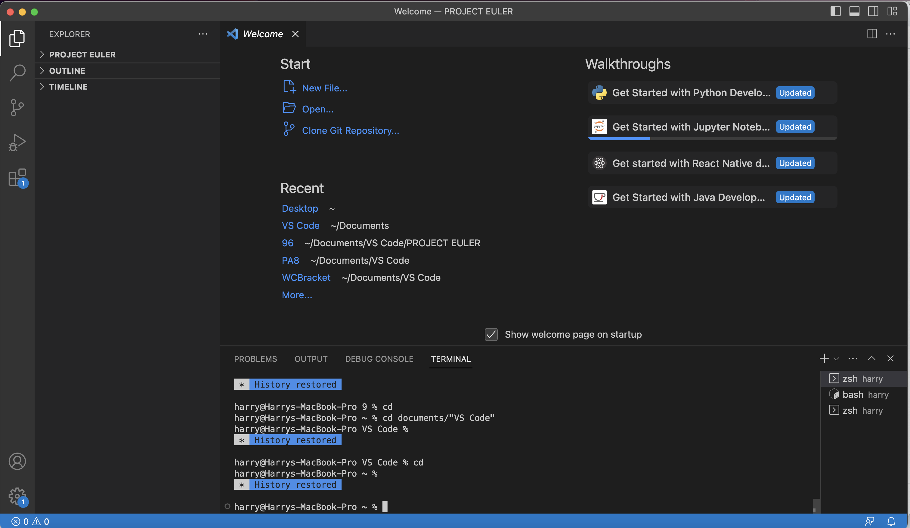
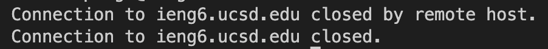
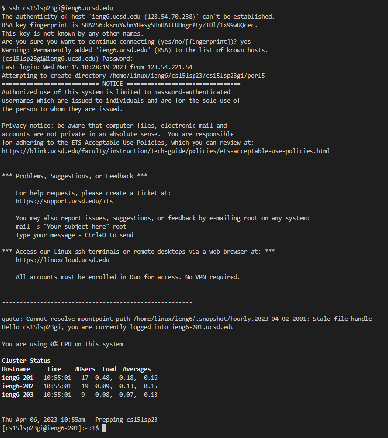
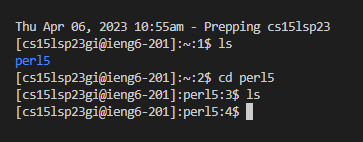

# CSE15L Lab Report 1
### Harry Lonsdale

## Installing VS Code
Welcome! This is a tutorial on how to log into external computers on `ieng6` using the `ssh` command in the terminal of VS Code. To explain how to do this, I'll walk through all of the steps that I took along this journey.

To start, you should download __VS Code__ onto your computer from online. I already had VS Code installed, but if you don't, make sure to follow the instructions to download it yourself at [this link](https://code.visualstudio.com/). It's important that we have VS Code installed in order to use the terminal within the app. Once you have it installed, open the application and you should see a screen that looks something like this:

## Connecting to Ieng6
Now that that's out of the way, it's time to begin remotely connecting to `ieng6`. Use the command `$ ssh cs15lsp23zz@ieng6.ucsd.edu` and replace the "zz" with the corresponding characters in your CSE15L ID. After that, the terminal should return a prompt like this:

`(cs15lsp23zz@ieng6.ucsd.edu) Password: `

When you type your password in after this prompt, the password may not appear on the screen - but __don't worry, the computer is registering your inputs__, it just doesn't show it for privacy reasons (in case somebody was peeking over your shoulder). Type in your newly reset cse15L account password and press enter.

When I tried that sequence on my macbook, the terminal replied with this: 

I was stuck here for a while, attempting to connect on my macbook, before I decided to try logging in on one of the lab PCs instead. I performed the same sequence of `ssh` and entering my password, and it worked this time. So if you're seeing a similar issue to the one I had, try using a different computer and check if you can log in there.

This is the result that the terminal printed after my successful login to the __ieng6__ server on the lab computer.

## Running Commands Remotely

Now you can try running some commands on the remote computer. Play around and see what you can do! I tried using `ls` to list the files and directories that were available to me. I saw that there was a __directory__ named `perl5`. I used `cd` to change directories to perl5 but using `ls` now does not show any new files or directories inside of perl5.

