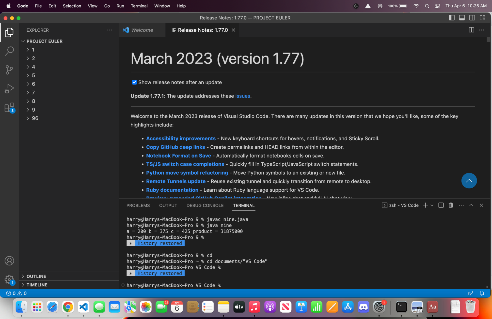

# CSE15L Lab Report 1
## Harry Lonsdale

Welcome! This is a tutorial on how to log into external computers on ieng6 using the `ssh` command in the terminal of VS Code. To explain how to do this, I'll walk through all of the steps that I took along this journey.

To start, you should download VS Code onto your computer from online. I already had VS Code installed, but if you don't, make sure to follow the instructions to download it yourself at [Link](https://code.visualstudio.com/). It's important that we have VS Code installed in order to use the terminal within the app. Once you have it installed, open the application and you should see a screen that looks something like this:

