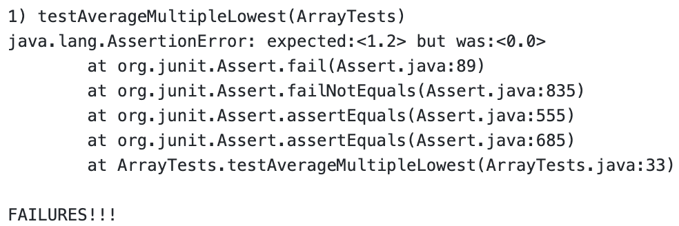

# CSE15L Lab Report 2
## Harry Lonsdale

## Part 1: StringServer and localhost

**This was the code for my StringServer**
<br/><br/>

<br/>

<br/>
**And here are some screenshots of it in use**. 

For the **first** screenshot:
- Which methods in your code are called?

  My code would first run the `main` method of the class StringServer which calls `server.start` with a new instantiation of the Handler class. When a new url is typed in, the Handler's `handleRequest` method is called.
- What are the relevant arguments to those methods, and the values of any relevant fields of the class?

  The argument to the `main` method of StringServer is the port number, which is relevant as it is used to decide the localhost port number on which the server will run. The arguments for `server.start` are important because they determine the port number (passed in from main) and the Handler that it will use, which is a new instantiation of the class I wrote. The argument passed into `handleRequest` is the url that is typed in, which determines the function of the program. The value of `String str` is "add this\n" after this screenshot.
- How do the values of any relevant fields of the class change from this specific request? If no values got changed, explain why

  The value of `String str` was changed by this specific request because "add this\n" was concatenated to `str`. Before this was run, `str` was just the empty String "".

For the **second** screenshot:
- Which methods in your code are called?

 My code would first run the `main` method of the class StringServer which calls `server.start` with a new instantiation of the Handler class. When a new url is typed in, the Handler's `handleRequest` method is called.
 
 - What are the relevant arguments to those methods, and the values of any relevant fields of the class?

  The argument to the `main` method of StringServer is the port number, which is relevant as it is used to decide the localhost port number on which the server will run. The arguments for `server.start` are important because they determine the port number (passed in from main) and the Handler that it will use, which is a new instantiation of the class I wrote. The argument passed into `handleRequest` is the url that is typed in, which determines the function of the program. The value of `String str` is `"add this\nandThisToo\n"` after this screenshot.
  
 - How do the values of any relevant fields of the class change from this specific request? If no values got changed, explain why

  The value of `String str` was changed by this specific request because "andThisToo\n" was concatenated to `str`. Before this was run, `str` was `add this\n`.
  
## Part 2: Bug Hunting

The bug that I'm choosing to report on is the bug in `averageWithoutLowest`.

Here's a failure-inducing jUnit test for this method.
```
  @Test
  public void testAverageMultipleLowest(){
    double[] input = new double[]{1.2, 1.2, 1.2, 1.2, 1.2};
    double output = ArrayExamples.averageWithoutLowest(input);
    assertEquals(1.2,output,0.0);
  }
```

- The expected output of this code is 1.2, because even if you drop the single lowest value (one of the 1.2s), the other four 1.2s will still cause the average to be 1.2.
- Here's a jUnit test that does not cause a failure:
```
  @Test
  public void testAverageWithoutLowestBasic(){
    double[] input = new double[]{2.0, 1.2, 1.7, 2.3, 2.0};
    double output = ArrayExamples.averageWithoutLowest(input);
    assertEquals(2.0,output,0.0);
  }
```

This is the output of running those two tests:



As you can see, the returned value for the first test was **0.0**, not what we expected!

Interestingly, the test that did not have multiple of the lowest number in the array did not fail.

```
static double averageWithoutLowest(double[] arr) {
    if(arr.length < 2) { return 0.0; }
    double lowest = arr[0];
    for(double num: arr) {
      if(num < lowest) { lowest = num; }
    }
    double sum = 0;
    for(double num: arr) {
      if(num != lowest) { sum += num; }
    }
    return sum / (arr.length - 1);
  }
```
A closer inspection of the source code for `ArrayExamples.averageWithoutLowest` (displayed above) reveals that the check to remove the lowest value is incorrect! Because the if statement while summing the values checks `num != lowest` every time, it would not count any duplicates of the lowest number either. Here's a fix for this issue:

```
  static double averageWithoutLowest(double[] arr) {
    if(arr.length < 2) { return 0.0; }
    double lowest = arr[0];
    for(double num: arr) {
      if(num < lowest) { lowest = num; }
    }
    double sum = 0;
    boolean removed = false;
    for(double num: arr) {
      if(removed || num != lowest) { sum += num; }
      else{removed = true;}
    }
    return sum / (arr.length - 1);
  }
```

Now we're checking if the lowest has already been removed first. Then, if it hasn't, we check if the current number is the lowest. If it is, we skip it and mark removed as true. If it's not the lowest, then we're good to add it and cautiously continue.

## Part 3: What have I learned?

Something interesting that I learned from lab #2 was how to localhost and run my java program on a server. I never knew that I could do this before, but it seems like a useful tool with a number of applications. I thought it was really interesting learning about how we can use the url to manipulate data stored by the program.
