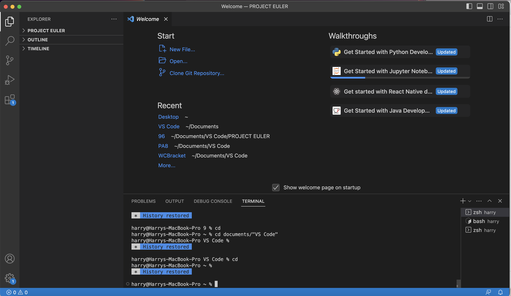
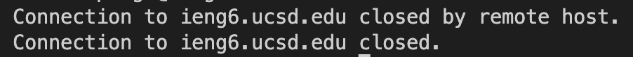
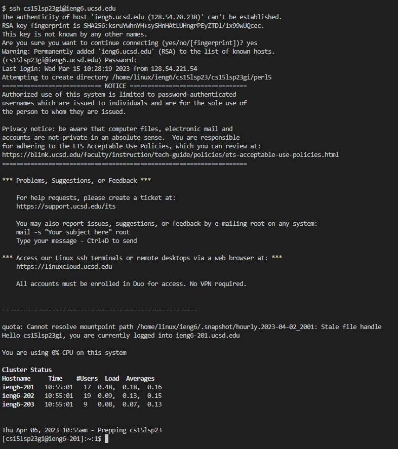
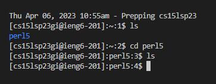

# CSE15L Lab Report 5
## Harry Lonsdale

## Part 1: Debugging Scenario

**What environment are you using (computer, operating system, web browser, terminal/editor, and so on)?**

I'm using an M1 Macbook pro running commands from my terminal application window (not VS Code). 


**Detail the symptom you're seeing. Be specific; include both what you're seeing and what you expected to see instead. Screenshots are great, copy-pasted terminal output is also great. Avoid saying “it doesn't work”.**


I'm expecting to see the output of my bash script, which tells me "All done! output: " with the output at the end. However, I'm not even seeing that all done message. 

**Detail the failure-inducing input and context. That might mean any or all of the command you're running, a test case, command-line arguments, working directory, even the last few commands you ran. Do your best to provide as much context as you can.**

The failure-inducing input is just me runnign my bash script. Here are the contents of the bash script:


## TA Response: 

Hey! Think a little more about which directory your bash script is in before you use grep! Try using ls after using pwd to make sure you're calling grep correctly! 

As for not seeing your all done message, look into the documentation for `set -e`, which you have at the start of your bash script.

-Helpful TA

## Student Response: 

Ohhh, I see, I forgot that at this point I was in the GitHub directory still, so I needed to use /cse15l-lab-reports/labReport1.md or `cd` before calling grep in order to access that. And as for the all done message, I'm now realizing that set -e was causing the script to exit at the first error, so it never got to the line where we echo the error message.

**File & directory structure:**
```
 -Github
 
     -cse15l-lab-reports
     
         -labReport1.md
         
         -labReport2.md
         
         -labReport3.md
         
         -labReport4.md
         
         -labReport5.md
         
     - docsearch
     
     - list-examples-grader
     
     - Wavelet
```
**Contents of labReport1:**

```
# CSE15L Lab Report 1
## Harry Lonsdale

## Installing VS Code
Welcome! This is a tutorial on how to log into external computers on `ieng6` using the `ssh` command in the terminal of VS Code. To explain how to do this, I'll walk through all of the steps that I took along this journey.

To start, you should download __VS Code__ onto your computer from online. I already had VS Code installed, but if you don't, make sure to follow the instructions to download it yourself at [this link](https://code.visualstudio.com/). It's important that we have VS Code installed in order to use the terminal within the app. Once you have it installed, open the application and you should see a screen that looks something like this:



<br/><br/><br/>
## Connecting to Ieng6
Now that that's out of the way, it's time to begin remotely connecting to `ieng6`. Use the command `$ ssh cs15lsp23zz@ieng6.ucsd.edu` and replace the "zz" with the corresponding characters in your CSE15L ID. After that, the terminal should return a prompt like this:

`(cs15lsp23zz@ieng6.ucsd.edu) Password: `

When you type your password in after this prompt, the password may not appear on the screen - but __don't worry, the computer is registering your inputs__, it just doesn't show it for privacy reasons (in case somebody was peeking over your shoulder). Type in your newly reset cse15L account password and press enter.

When I tried that sequence on my macbook, the terminal replied with this: 



I was stuck here for a while, attempting to connect on my macbook, before I decided to try logging in on one of the lab PCs instead. I performed the same sequence of `ssh` and entering my password, and it worked this time. So if you're seeing a similar issue to the one I had, try using a different computer and check if you can log in there.



This is the result that the terminal printed after my successful login to the __ieng6__ server on the lab computer.

<br/><br/>
## Running Commands Remotely

Now you can try running some commands on the remote computer. Play around and see what you can do! I tried using `ls` to list the files and directories that were available to me. I saw that there was a __directory__ named `perl5`. I used `cd` to change directories to perl5 but using `ls` now does not show any new files or directories inside of perl5.


```
 
 **Contents of script.sh:**
 ```
 set -e

wc cse15l-lab-reports/labReport1.md
pwd
grep "Ieng6" labreport1.md | grepResults.txt
echo "All done! output : "
cat grepResults.txt
```

**Commands run:**

`bash script.sh`

**What to fix:**

Edit script.sh to read as such: 

```
set -e

wc cse15l-lab-reports/labReport1.md
pwd
grep "Ieng6" cse15l-lab-reports/labreport1.md | grepResults.txt
echo "All done! output : "
cat grepResults.txt
```
Then run it again

## Part 2: Reflection

Something very interesting that I learned in the second half of this quarter was how to use vim. Vim is a very useful tool to edit files from the command line efficiently. I think I'll still do most of my coding in VS Code, but I definitely think that my vim skills will help me out in future, because sometimes it's convenient to edit things straight from the command line instead of opening up some program to edit it.
